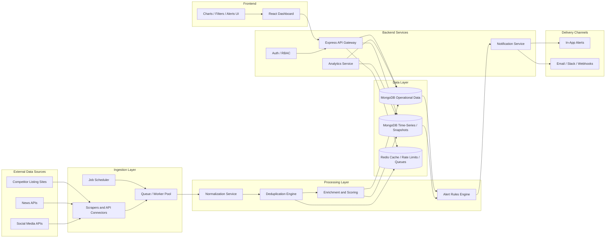

# Competitive Market Intelligence & Monitoring Dashboard

## 1. High-Level Architecture Diagram



## 2. Folder Structure

```text
market-intelligence-dashboard/
  frontend/
    public/
    src/
      app/
        routes/
        store/
        providers/
      components/
        charts/
        filters/
        tables/
        alerts/
        layout/
      features/
        dashboard/
        competitors/
        listings/
        analytics/
        alerts/
        auth/
      hooks/
      services/
        api/
        sockets/
      utils/
      styles/
      types/
    package.json

  backend/
    src/
      config/
      modules/
        auth/
        competitors/
        listings/
        ingestion/
        analytics/
        alerts/
        news/
        social/
      routes/
      controllers/
      services/
        scraping/
        normalization/
        deduplication/
        scoring/
        notifications/
      jobs/
        schedulers/
        workers/
        processors/
      models/
      repositories/
      middleware/
      utils/
      events/
      app.js
      server.js
    package.json

  infra/
    docker/
    nginx/
    monitoring/
    scripts/

  docs/
    api-overview.md
    data-model.md
    alert-rules.md

  .env.example
  docker-compose.yml
  architecture.md
```

## 3. Data Flow Explanation

### A. Ingestion
1. Scheduled background jobs trigger source-specific collectors for listing sites, news APIs, and social platforms.
2. API-based sources are pulled through authenticated connectors; listing sites are collected through resilient scraper workers.
3. Every ingestion run writes raw payload metadata, fetch status, timestamps, and source identifiers for traceability.

### B. Normalization
1. Raw records are transformed into a unified schema for competitors, listings, articles, and social signals.
2. Fields like area, category, price, currency, property type, posted date, and listing status are standardized.
3. A source mapping layer converts competitor-specific labels into internal enums.

### C. Deduplication
1. Deduplication first uses deterministic keys when available, such as source listing ID plus competitor.
2. If source IDs are unreliable, fuzzy matching compares normalized title, location, price band, category, and media hashes.
3. Records are merged into a canonical entity with source references and confidence scores.

### D. Storage and Analytics
1. Canonical entities are stored in MongoDB collections for operational queries.
2. Historical price and status snapshots are appended to time-series style collections for trend analysis.
3. Aggregation pipelines and precomputed summary collections power dashboard filters, charts, and heat scores.

### E. Alerts
1. New or changed records stream into an alert rules engine.
2. Rules evaluate changes such as price drops, new competitor activity, abnormal listing velocity, or heat spikes.
3. Matching events are pushed to in-app notifications and optional email, Slack, or webhook channels.

## 4. Key Technologies and Libraries

### Frontend
- React.js for UI composition
- React Router for route management
- TanStack Query for API state and caching
- Zustand or Redux Toolkit for app-level state
- Recharts or Apache ECharts for analytics visualizations
- Socket.IO client for near real-time alerts
- Tailwind CSS or Material UI depending on design direction

### Backend
- Node.js + Express for REST APIs
- Mongoose for MongoDB modeling
- BullMQ or Agenda for background jobs
- Redis for queues, caching, rate limiting, and worker coordination
- Axios for external API calls
- Cheerio or Playwright for controlled scraping workflows
- Socket.IO for live dashboard updates
- Joi or Zod for request validation
- Winston or Pino for structured logging

### Database and Infrastructure
- MongoDB for normalized entities, snapshots, alerts, and analytics summaries
- Redis for queues and short-lived cache
- Docker for local and deployment consistency
- Nginx as reverse proxy / API gateway edge layer
- Prometheus + Grafana or equivalent for operational monitoring

## 5. API Design Overview

### Core Resource Groups

#### Competitors
- `GET /api/competitors`
- `POST /api/competitors`
- `GET /api/competitors/:id`
- `PATCH /api/competitors/:id`

#### Listings
- `GET /api/listings`
  - Supports filters: `area`, `competitor`, `category`, `status`, `dateFrom`, `dateTo`
- `GET /api/listings/:id`
- `GET /api/listings/:id/history`

#### Analytics
- `GET /api/analytics/price-trends`
- `GET /api/analytics/listing-velocity`
- `GET /api/analytics/market-heat-index`
- `GET /api/analytics/overview`

#### News and Social Signals
- `GET /api/news`
- `GET /api/social-signals`
- `GET /api/signals/summary`

#### Alerts
- `GET /api/alerts`
- `POST /api/alerts/rules`
- `PATCH /api/alerts/rules/:id`
- `GET /api/alerts/stream`

#### Ingestion / Admin
- `POST /api/ingestion/run`
- `GET /api/ingestion/jobs`
- `GET /api/ingestion/jobs/:id`

## Deduplication Strategy

- Primary key strategy: `source + externalId`
- Secondary fallback: fuzzy fingerprint on normalized `title + competitor + area + category + rounded price`
- Merge policy:
  - Keep canonical entity stable
  - Store all raw source references
  - Track confidence score and merge history
- Conflict policy:
  - Prefer newest verified timestamp
  - Preserve raw values for auditability

## Anti-Scraping Strategy

- Prefer official APIs where available before scraping
- Rotate user agents and request signatures carefully
- Use proxy rotation and geographic distribution only where legally allowed
- Randomize crawl timing with adaptive backoff
- Respect robots, terms, and rate limits where applicable
- Use headless browsers only for JS-rendered targets
- Detect CAPTCHA / blocks and route to retry or quarantine queues
- Cache unchanged pages and use incremental fetching to reduce footprint

## Analytical Insight Definitions

### 1. Price Tracking Over Time
- Time-series snapshots of listing prices
- Visualize per competitor, area, and category
- Detect price drops, spikes, and sustained trends

### 2. Listing Velocity
- Number of new listings added, updated, or removed over a time window
- Useful for identifying aggressive competitor expansion or slowdown

### 3. Market Heat Index
- Composite score based on:
  - Listing volume
  - Price movement intensity
  - Listing velocity
  - News activity
  - Social buzz / sentiment shifts
- Output as index by area, category, or competitor

## Scalability Notes

- Horizontal worker scaling for ingestion and normalization
- Separate API nodes from worker nodes
- Queue-based ingestion to smooth spikes
- Cache hot dashboard queries in Redis
- Use MongoDB indexes on filters like area, competitor, category, timestamp, and status
- Precompute analytics summaries for large date ranges
- WebSocket or event-driven alerting for near real-time UX
- Add per-source connectors so new competitors or channels can be onboarded independently
```
